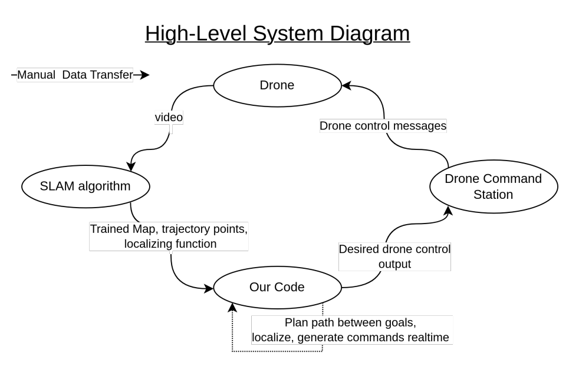
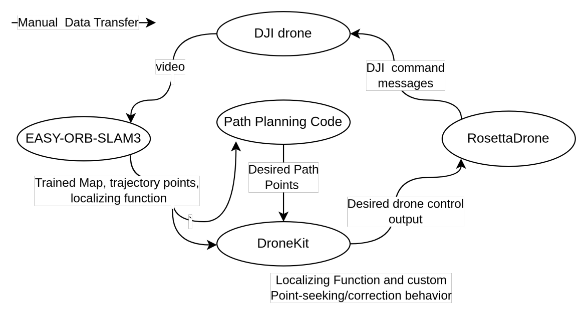

---
# Feel free to add content and custom Front Matter to this file.
# To modify the layout, see https://jekyllrb.com/docs/themes/#overriding-theme-defaults

layout: home
---

<figure
    style=
        "display: block;
        margin-left: auto;
        margin-right: auto;
        width:90%;"
>
    
</figure>

## Goals and Methods

The original goal of our project was to be able to use a drone’s camera to create a map of its environment as it navigates through a space and to determine where in the map the drone is as it flies; we intended to give the drone starting and stopping markers within its environment and to determine the best path from one marker to the other. In order to successfully meet these goals, we needed to determine how to interconnect several components that address separate portions of the problem to interact as a cohesive system.

The drone we are using for this project is a DJI Mavic Mini. It can be controlled manually using its own controller and proprietary drone communication system; however, our ultimate vision was to give the drone a path, or a series of flight commands, and have it navigate the space on its own. Therefore, we looked into software tools that would allow us to bridge the gap between a Python script that would ultimately give directions to the drone and the drone’s own communication language.

The mapping of the environment is done with the single camera on the drone, so we determined early on that we would be using monocular visual simultaneous localization and mapping (monocular vSLAM), which is an algorithm for creating a map of the agent’s environment and determining its position within that environment at the same time. We initially intended to implement our own version of monocular vSLAM but, after doing initial research into the vSLAM space, determined that it would be more feasible to begin with an existing implementation and modify it to fit our needs. Specifically, we were looking to develop compelling visuals of the mapping generated by our vSLAM algorithm, and we needed a tool that would allow for the integration between the drone’s live camera feed and the vSLAM algorithm.

Thus, a large portion of our project was researching and analyzing tools that would allow us to achieve the integration we were looking for, and our project goals transitioned into building an effective drone control system.

## Project Summary

In order to build a cohesive drone system to ultimately complete our originally intended tasks, we needed to determine how to interconnect three main components: the drone, the vSLAM algorithm, and the drone control script that is run from a personal computer. We have a drone with its own controller that we would like to control through a Python script instead - what tools exist to allow us to bridge that gap? We have a vSLAM algorithm which runs on a computer, and a drone that can live stream its video to an IP address - how do we connect these pieces together? In this project, we did not focus on creating new componentry but finding existing tools that could achieve the goals of each subdivision of our project and be made to communicate with our other external tools. To achieve this, we developed a process for finding, analyzing, and incorporating new tools. In addition, we needed to continually revisit these considerations when using a tool. Is this tool really bringing the project forward, or standing in our way?

The beginning of our selection process was to transform our project goals into an overall system diagram. What managed what, and how much did it need to talk to other portions of the robotic system? What would be managed on the computer, what needed to happen in real time, and how would we interact with our hardware (computers and drones)?

<figure
    style=
        "display: block;
        margin-left: auto;
        margin-right: auto;
        width:90%;"
>
    
</figure>

Our approach to implementing this high level flow of information was to break it down into sub-components, or tool networks, and start by manually porting information between each tool network.

One tool network would control and manage the drone, and utilizes the following components: RosettaDrone, QGroundControl, DroneKit. RosettaDrone is a wrapper around the DJI drone’s control system that translates MAVLink, an open-source communication protocol, commands into something the drone can understand. QGroundControl is a control software that is installed on a computer that can communicate with RosettaDrone and send control commands. DroneKit is a Python package that allows a script to send MAVLink commands; DroneKit is determining the control signals to a flying drone based on a CV algorithm determined by our second tool network. This tool network bridges the gap between the drone and a Python drone control script.

The second tool network would manage the vSLAM algorithm. After exporting videos from our drone, we would plug those videos into a piece of vSLAM software to export the known positions and map, and create our own path management that works directly with these generated 3D pose estimations to create paths that could be sent out of this tool network to the first tool network. Within the timeline of this project, we were unable to complete the waypoint export and path planning step. We will talk about our challenges with this below.

See the figure below for our system architecture, where solid black arrows represent manual porting from one tool network to another.

<figure
    style=
        "display: block;
        margin-left: auto;
        margin-right: auto;
        width:90%;"
>
    
</figure>

## Design Decision Spotlight

Components are portions of our system which manage large operations. Components are made up of tools which interact with each other.

Our tool-review process began with researching a component. We would establish requirements (i.e. for the drone management, we needed to be able to receive data from the drone and send commands to it) and then search google as a whole as well as YouTube for other implementations of open-source tools which we could use. In this specific case, we identified that the component of drone communication and command could be filled with two tools, RosettaDrone for translating MavLink commands to DJI proprietary commands and sending them to the drone, and DroneKit for generating those commands to be sent to the drone.

Choosing between tools to fill the voids in our system components involved optimization criteria. We needed to acknowledge the weaknesses of each of our tools both before we chose to use them and while we were using them to see if they were really helping or holding back our process.

The main optimization criteria that we applied to each source was: how fast (realtime) is it? Is it compatible with ROS2 if it uses ROS, or does it even use ROS if that’s something that we expect in this component? Does it work with the types of data that we expect to be feeding this component (i.e. live video feed rather than preprocessed)? How clear is the documentation?

There were multiple points where we had selected tools, and then revisited this process before determining that we should replace that subcomponent. SLAM was the component where this happened the most frequently: we began with a visual odometry implementation from [this video](https://www.youtube.com/watch?v=N451VeA8XRA) on youtube with the intent to build our system on top of it. After working with it briefly, we determined that we wanted to work with a system that could operate on live video feed instead and had some ROS integration for visualization. In this way, we developed new optimization criteria as the project advanced.

After this first re-tooling, we did it another time with [this implementation of monocular SLAM](https://github.com/arthurfenderbucker/indoor_drone), which was useful for its incorporation of a full robotic system but was written in ROS 1. After both of these learnings, we found our final tool that we would use for SLAM, [EASY-ORB-SLAM3](https://www.youtube.com/watch?v=CRg8zmCNOAU) which fit all of our optimization criteria (realtime, ROS integration, thorough documentation, effectively fits into the workflows we expect).

## Challenges and Compromises

We were warned multiple times that the hardware implementation for this project would be tricky. Thanks to the wonderful community of RosettaDrone, that portion of the project actually went flawlessly. The true challenges lay in finding effective tools with which to perform SLAM.

Why not create a SLAM algorithm ourselves? We didn’t have the experience or development chops to bring up a SLAM algorithm in 3 weeks when we were also learning how this overall system would go together. A major choice that we made early in the project was that the end goal would guide us towards the work that we found interesting. It seemed that we had to choose to either build a drone system or build a SLAM algorithm, and we chose to build a drone system because it was more interesting to us.

The main obstacle that we encountered towards the end of the project that prevented a lot of path planning work being done was a lack of ability to access the data that was displayed in the ORB-SLAM3 window. Initially we believed that this data would be contained in ROS messages, but we soon realized that the ROS wrapper implemented in EASY-ORB-SLAM3 only allowed us to activate the program over ROS and use BAG files to record the images that were sent to ORB-SLAM3, so that we could run ORB-SLAM3 in a debug setting.

What we believed to be the case was that EASY-ORB-SLAM3 used ROS messages for its visualizer. For that reason, we hoped that we could process this data externally. Sadly, the data/visualization was all contained to the C++ code running as a dependency in the EASY-ORB repo. It was a long and fruitless journey through probably over 30 github issues, C++ documentation pages, and C++ guides that led us to small leads in what felt like an ocean of people who exported key points but didn’t go into detail as to how. In essence, we spent most of our time trying to acquire the basic building blocks of our function and came out unsuccessful.

## Retrospective and Improvements

### Retrospective

We spent a long time ensuring that we understood what our tools were doing and how before running them ourselves. Paradoxically (but to the surprise of no one), the project advanced the fastest when we implemented and used our tools as quickly as possible after finding them. If we were to engage in this project again, we would probably prioritize using the tools for what they are before analyzing their usefulness for our case. This would have allowed us to realize glaring inconsistencies before we spent time understanding the structure and functionality of a tool from its source code.

### Improvements

Right now, we manually pass data between our components. For example, we manually pass drone video to our SLAM algorithm. If we had gotten further in the project, we would manually pass those SLAM points to our pathing algorithm, and then manually hand those paths and SLAM maps to DroneKit which uses CV to figure out how to effectively navigate to the path. In our ideal drone control system, we would like to make the connections between our project componentry more autonomous and self-sustaining, as well as make re-implementation for others that would like to continue our work easier.

## Looking to Our Futures

Get things working quickly on a low scale. The discussion is an important part of the process, but coming from a basis of book knowledge and without implementation experience is doomed to “failure”. We learned a lot, and I’m sure that if we started this project again we could have achieved everything we set out to do - it was all in how we engaged in the project work.
